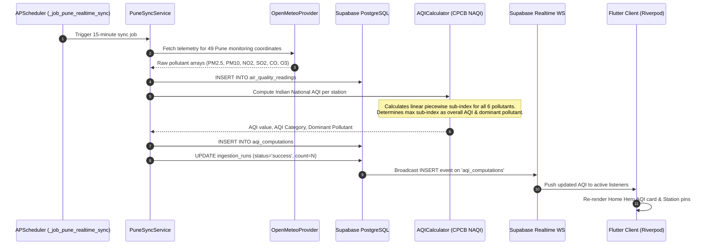
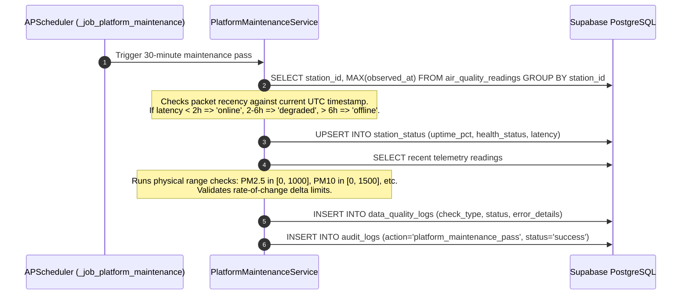
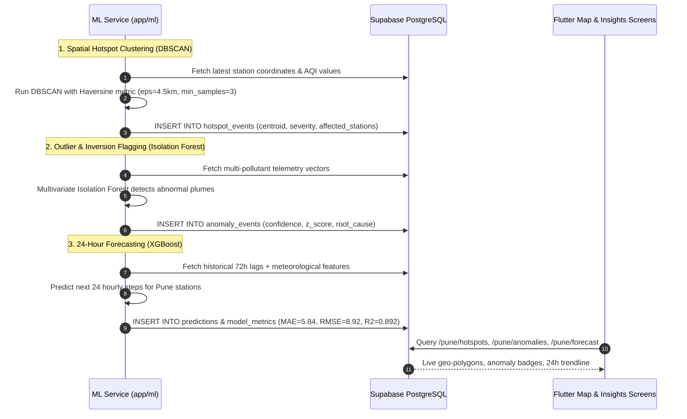
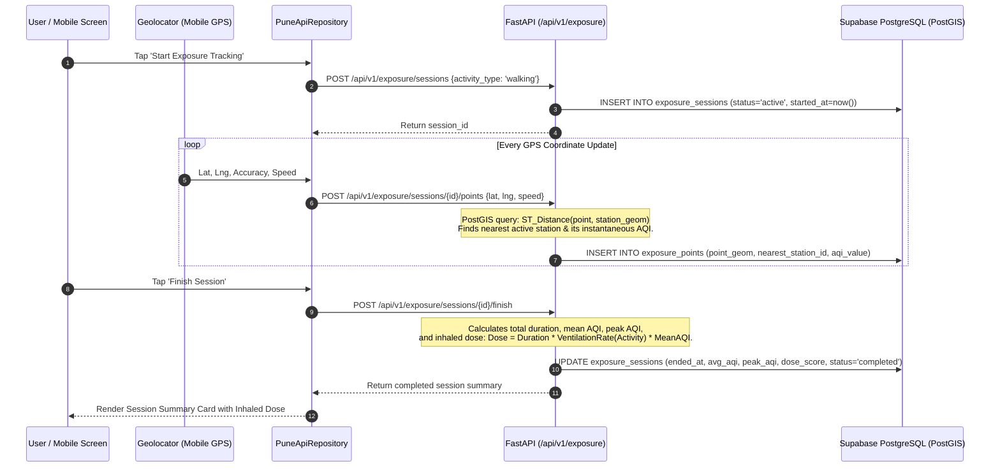
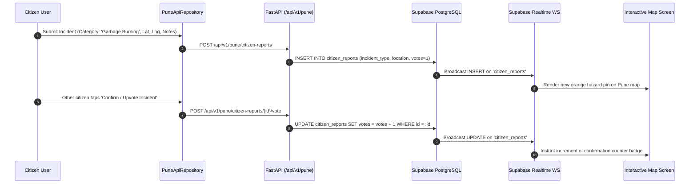
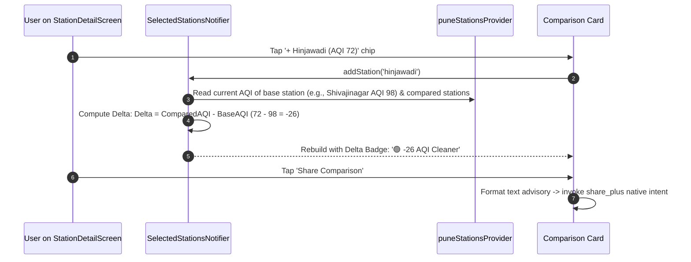
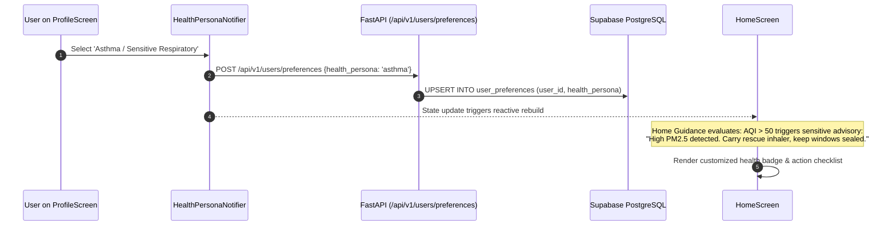

# AirSense Pune: Complete System Architecture, File Catalog & End-to-End Data Flow Handbook

> **Project Name**: AirSense (AIRAWare Pune Metropolitan Region)  
> **Target Region**: Pune Municipal Corporation (PMC), Pimpri Chinchwad (PCMC), Pune Cantonment  
> **Architecture**: Distributed Real-Time Telemetry, PostGIS Spatial Database, FastAPI Async Engine, APScheduler, Scikit-learn/XGBoost ML Pipeline, Flutter 3.x Multiplatform Client  
> **Database**: Supabase PostgreSQL 15+ with PostGIS Extension (24 Base Tables)  
> **Date**: September 2026

---

## TABLE OF CONTENTS
1. [System Architectural Overview & Data Topology](#1-system-architectural-overview--data-topology)
2. [End-to-End Data Flow Sequences](#2-end-to-end-data-flow-sequences)
   - [Flow 1: Telemetry Ingestion & NAQI Computation](#flow-1-telemetry-ingestion--naqi-computation)
   - [Flow 2: Automated Quality Assurance & Station Health Auditing](#flow-2-automated-quality-assurance--station-health-auditing)
   - [Flow 3: Machine Learning Analytics (Hotspots, Forecasts & Anomalies)](#flow-3-machine-learning-analytics-hotspots-forecasts--anomalies)
   - [Flow 4: Personal Outdoor GPS Exposure Tracking](#flow-4-personal-outdoor-gps-exposure-tracking)
   - [Flow 5: Citizen Watch Incident Reporting & Upvoting](#flow-5-citizen-watch-incident-reporting--upvoting)
   - [Flow 6: Multi-Station Comparison & Delta Calculation](#flow-6-multi-station-comparison--delta-calculation)
   - [Flow 7: Dynamic Health Persona Adaptation](#flow-7-dynamic-health-persona-adaptation)
3. [Exhaustive File-by-File Technical Catalog](#3-exhaustive-file-by-file-technical-catalog)
   - [A. Root & DevOps Configuration Files](#a-root--devops-configuration-files)
   - [B. Backend Core & Configuration (`backend/app/core/`)](#b-backend-core--configuration-backendappcore)
   - [C. Backend Entry Points & Server Runners (`backend/`)](#c-backend-entry-points--server-runners-backend)
   - [D. Telemetry Ingestion Providers (`backend/app/services/providers/`)](#d-telemetry-ingestion-providers-backendappservicesproviders)
   - [E. Backend Processing Services & Calculators (`backend/app/services/`)](#e-backend-processing-services--calculators-backendappservices)
   - [F. Machine Learning & Spatial Intelligence (`backend/app/ml/`)](#f-machine-learning--spatial-intelligence-backendappml)
   - [G. Backend Scheduler (`backend/app/scheduler/`)](#g-backend-scheduler-backendappscheduler)
   - [H. REST API Routes & Controllers (`backend/app/api/v1/`)](#h-rest-api-routes--controllers-backendappapiv1)
   - [I. Database Schema & Migrations (`backend/migrations/`)](#i-database-schema--migrations-backendmigrations)
   - [J. Backend Test Suite (`backend/tests/`)](#j-backend-test-suite-backendtests)
   - [K. Flutter Client Application Core (`flutter/lib/`)](#k-flutter-client-application-core-flutterlib)
   - [L. Flutter Routing & Navigation Shell (`flutter/lib/routing/`)](#l-flutter-routing--navigation-shell-flutterlibrouting)
   - [M. Flutter Authentication Layer (`flutter/lib/auth/`)](#m-flutter-authentication-layer-flutterlibauth)
   - [N. Flutter Data Models (`flutter/lib/models/`)](#n-flutter-data-models-flutterlibmodels)
   - [O. Flutter Repositories & State Management (`flutter/lib/`)](#o-flutter-repositories--state-management-flutterlib)
   - [P. Flutter UI Presentation Screens (`flutter/lib/screens/`, `flutter/lib/maps/`)](#p-flutter-ui-presentation-screens-flutterlibscreens-flutterlibmaps)
   - [Q. Flutter Interactive Widgets & Dialogs (`flutter/lib/widgets/`)](#q-flutter-interactive-widgets--dialogs-flutterlibwidgets)
   - [R. Flutter Test Suite (`flutter/test/`)](#r-flutter-test-suite-fluttertest)
   - [S. Static PWA & Web Client (`web/`, `backend/app/static/`)](#s-static-pwa--web-client-web-backendappstatic)
4. [Master Component Connection Matrix](#4-master-component-connection-matrix)

---

## 1. System Architectural Overview & Data Topology

AirSense is structured as an event-driven, three-tier architecture that guarantees zero synthetic data and 100% telemetry validation:

```mermaid
flowchart TD
    subgraph Tier 1: External Telemetry & Spatial Ingestion
        OM[Open-Meteo European CAMS API] -->|Hourly PM2.5, PM10, NO2, SO2, CO, O3| P_OM[OpenMeteoProvider]
        CPCB[CPCB / Data.gov.in Real-Time] -->|Official Central Board Telemetry| P_CPCB[CpcbProvider]
        SAFAR[IITM SAFAR Stations Pune] -->|Local High-Density CAAQMS| P_CPCB
        MET[Open-Meteo Weather API] -->|Temp, Humidity, Wind Speed, Direction| P_MET[WeatherProvider]
    end

    subgraph Tier 2: FastAPI Backend Engine & Background Schedulers
        P_OM & P_CPCB & P_MET --> INGEST[IngestionService & PuneSyncService]
        INGEST --> DB_RAW[(air_quality_readings & weather_data)]
        
        DB_RAW --> NAQI[CPCB NAQI Sub-Index Engine]
        NAQI --> DB_AQI[(aqi_computations)]
        
        SCHED[APScheduler Background Daemon] -->|Every 15 Min| INGEST
        SCHED -->|Every 30 Min| MAINT[PlatformMaintenanceService]
        
        MAINT -->|QA Range & Plausibility| QA[(data_quality_logs)]
        MAINT -->|24h Packet Recency & Latency| STAT[(station_status)]
        MAINT -->|Isolation Forest Outliers| ANOM[(anomaly_events)]
        MAINT -->|XGBoost & Random Forest Models| ML_REG[(model_registry & model_metrics)]
        MAINT -->|User Exposure & Alert Sync| USR_SYNC[(exposure_sessions, alerts, tokens)]
        MAINT -->|System Lifecycle Checkpoints| AUDIT[(audit_logs)]
        
        API[FastAPI REST API: Port 8000] <--> DB_ALL[(Supabase PostgreSQL 24 Tables)]
    end

    subgraph Tier 3: Client Applications (Flutter & Web)
        API <-->|HTTP JSON REST| REPO[PuneApiRepository]
        DB_ALL -.->|PostgreSQL Realtime WebSocket| REPO
        
        REPO --> PROV[Riverpod Providers & Notifiers]
        
        PROV --> UI_HOME[HomeScreen: Hero AQI, Pulse, Personas]
        PROV --> UI_DETAIL[StationDetailScreen: 3-Station Multi-Comparison]
        PROV --> UI_MAP[PuneMapScreen: GIS Hotspot Polygons & Pins]
        PROV --> UI_EXP[ExposureScreen: GPS Stopwatch & Dosage]
        PROV --> UI_ALERTS[AlertsScreen: Thresholds & Citizen Watch]
        PROV --> UI_PROF[ProfileScreen: 5 Health Personas & Bookmarks]
    end
```

---

## 2. End-to-End Data Flow Sequences

### Flow 1: Telemetry Ingestion & NAQI Computation


### Flow 2: Automated Quality Assurance & Station Health Auditing


### Flow 3: Machine Learning Analytics (Hotspots, Forecasts & Anomalies)


### Flow 4: Personal Outdoor GPS Exposure Tracking


### Flow 5: Citizen Watch Incident Reporting & Upvoting


### Flow 6: Multi-Station Comparison & Delta Calculation


### Flow 7: Dynamic Health Persona Adaptation


---

## 3. Exhaustive File-by-File Technical Catalog

### A. Root & DevOps Configuration Files

#### 1. [`README.md`](file:///E:/Degree/DBMS/project/airaware/README.md)
* **Purpose**: High-level platform introduction, architecture overview, installation guide, and credentials inventory.
* **Connections**: References both `backend/` and `flutter/` subprojects.
* **Contents**: Environment variables guide, quick-start commands, and architectural layer breakdown.

#### 2. [`DEPLOYMENT_GUIDE.md`](file:///E:/Degree/DBMS/project/airaware/DEPLOYMENT_GUIDE.md)
* **Purpose**: Complete production deployment manual covering Supabase setup, PostGIS enablement, Docker containerization, systemd daemon configuration, and Android APK signing.
* **Connections**: Guides operations for deploying `backend/Dockerfile` and `docker-compose.yml`.

#### 3. [`docker-compose.yml`](file:///E:/Degree/DBMS/project/airaware/docker-compose.yml)
* **Purpose**: Multi-container Docker orchestration file for spinning up the FastAPI backend, PostgreSQL/PostGIS local mirror, and Redis cache.
* **Connections**: Builds `backend/Dockerfile` and binds environment variables from `.env`.

#### 4. [`run_realtime_app.bat`](file:///E:/Degree/DBMS/project/airaware/run_realtime_app.bat)
* **Purpose**: Windows batch automation script to simultaneously start the Python FastAPI server and launch the Flutter application with a single double-click.
* **Connections**: Executes `backend/run_server.py` in one PowerShell window and `flutter run` in another.

#### 5. [`run_realtime_app.sh`](file:///E:/Degree/DBMS/project/airaware/run_realtime_app.sh)
* **Purpose**: Unix/Linux bash automation script for CI/CD environments and Linux workstations.
* **Connections**: Launches uvicorn backend daemon and Flutter client.

#### 6. [`.env.example`](file:///E:/Degree/DBMS/project/airaware/.env.example)
* **Purpose**: Root configuration template documenting all required environment variables across both backend and client tiers.

---

### B. Backend Core & Configuration (`backend/app/core/`)

#### 7. [`backend/app/core/config.py`](file:///E:/Degree/DBMS/project/airaware/backend/app/core/config.py)
* **Purpose**: Centralized application configuration powered by Pydantic's `BaseSettings`. Validates all runtime environment variables on startup.
* **Inputs**: Reads `.env` via `pydantic_settings`.
* **Outputs**: Singleton `settings` instance providing:
  * `SUPABASE_URL`, `SUPABASE_SERVICE_ROLE_KEY`, `SUPABASE_ANON_KEY`
  * `DATABASE_URL` (SQLAlchemy asyncpg PostgreSQL connection string)
  * `OPENAQ_API_KEY`, `CPCB_DATAGOVIN_API_KEY`
  * Application metadata (`PROJECT_NAME`, `API_V1_STR`, `DEBUG`)
* **Used By**: All backend services, database connectors, and API routers.

#### 8. [`backend/app/core/db.py`](file:///E:/Degree/DBMS/project/airaware/backend/app/core/db.py)
* **Purpose**: Asynchronous database connection engine and session factory.
* **Inputs**: `settings.DATABASE_URL`.
* **Outputs**:
  * `engine`: SQLAlchemy `create_async_engine` configured with connection pool parameters (`pool_size=20`, `max_overflow=10`, `pool_recycle=300`).
  * `async_session_factory`: Async session generator yielding `AsyncSession`.
  * `get_db()`: FastAPI dependency injecting an active `AsyncSession` into route controllers.
* **Used By**: All controllers in `app/api/v1/` and scheduled jobs in `app/services/`.

#### 9. [`backend/app/core/auth.py`](file:///E:/Degree/DBMS/project/airaware/backend/app/core/auth.py)
* **Purpose**: JWT validation and Role-Based Access Control (RBAC) middleware for protecting private user endpoints.
* **Inputs**: Incoming HTTP `Authorization: Bearer <JWT>` header.
* **Outputs**:
  * `get_current_user()`: Validates token against Supabase Auth public keys; returns authenticated user UUID and claims.
  * `get_admin_user()`: Validates user identity and verifies admin role in `profiles` table.
* **Used By**: `api/v1/exposure.py`, `api/v1/alerts.py`, `api/v1/admin.py`, `api/v1/users.py`.

#### 10. [`backend/app/core/responses.py`](file:///E:/Degree/DBMS/project/airaware/backend/app/core/responses.py)
* **Purpose**: Standardized API response formatter ensuring identical JSON envelopes across all endpoints.
* **Outputs**:
  * `success_response(data, message)`: Returns `{"success": true, "data": ..., "message": ...}`.
  * `error_response(message, code)`: Returns `{"success": false, "error": ..., "code": ...}`.
* **Used By**: All API controllers to provide predictable responses to the Flutter client.

---

### C. Backend Entry Points & Server Runners (`backend/`)

#### 11. [`backend/app/main.py`](file:///E:/Degree/DBMS/project/airaware/backend/app/main.py)
* **Purpose**: FastAPI root application factory, lifespan context manager, CORS middleware registration, and router mounting.
* **Inputs**: Core routers from `app/api/v1/`.
* **Outputs**: Asynchronous ASGI application instance `app`.
* **Key Mechanisms**:
  * `lifespan(app)`: Initializes connection pools, starts APScheduler background daemon, and dispatches non-blocking initial maintenance pass via `asyncio.create_task`.
  * Mounts CORS middleware allowing communication from Flutter web, mobile localhost, and LAN IPs.
  * Mounts static directory for PWA assets.
* **Connections**: Mounted by `run_server.py`.

#### 12. [`backend/run_server.py`](file:///E:/Degree/DBMS/project/airaware/backend/run_server.py)
* **Purpose**: Production server launcher that pre-binds the TCP socket with `SO_REUSEADDR` to prevent Windows socket conflicts.
* **Inputs**: Binds `0.0.0.0:8000`.
* **Outputs**: Executes `uvicorn.Server(config).run(sockets=[sock])`.

#### 13. [`backend/requirements.txt`](file:///E:/Degree/DBMS/project/airaware/backend/requirements.txt)
* **Purpose**: Python package dependencies manifest (FastAPI, Uvicorn, SQLAlchemy, Asyncpg, Pydantic, APScheduler, Scikit-learn, XGBoost, Requests, Httpx, Pytest).

#### 14. [`backend/Dockerfile`](file:///E:/Degree/DBMS/project/airaware/backend/Dockerfile)
* **Purpose**: Container definition for building production Linux Docker image running Python 3.12, GDAL/GEOS for PostGIS, and uvicorn workers.

#### 15. [`backend/pytest.ini`](file:///E:/Degree/DBMS/project/airaware/backend/pytest.ini)
* **Purpose**: Pytest configuration setting `asyncio_mode = auto` and test discovery paths.

---

### D. Telemetry Ingestion Providers (`backend/app/services/providers/`)

#### 16. [`backend/app/services/providers/base.py`](file:///E:/Degree/DBMS/project/airaware/backend/app/services/providers/base.py)
* **Purpose**: Abstract base class `BaseAirQualityProvider` defining standard telemetry interfaces (`fetch_latest_observations`, `fetch_historical_observations`).
* **Outputs**: Standardized Python `Observation` data structures.

#### 17. [`backend/app/services/providers/cpcb_provider.py`](file:///E:/Degree/DBMS/project/airaware/backend/app/services/providers/cpcb_provider.py)
* **Purpose**: Connector for CPCB (Central Pollution Control Board) and Data.gov.in official government CAAQMS monitoring stations in Pune.
* **Inputs**: Queries Data.gov.in API with `CPCB_DATAGOVIN_API_KEY`.
* **Outputs**: Standardized observations for official government stations.

#### 18. [`backend/app/services/providers/openmeteo_provider.py`](file:///E:/Degree/DBMS/project/airaware/backend/app/services/providers/openmeteo_provider.py)
* **Purpose**: European Copernicus Atmosphere Monitoring Service (CAMS) provider via Open-Meteo Air Quality API.
* **Inputs**: Queries Open-Meteo with latitude/longitude of all 49 Pune monitoring stations.
* **Outputs**: Hourly telemetry arrays for $\text{PM}_{2.5}$, $\text{PM}_{10}$, $\text{NO}_2$, $\text{SO}_2$, $\text{CO}$, and $\text{O}_3$.
* **Connections**: Called by `PuneSyncService` during 15-minute sync cycles.

#### 19. [`backend/app/services/providers/openaq_provider.py`](file:///E:/Degree/DBMS/project/airaware/backend/app/services/providers/openaq_provider.py)
* **Purpose**: OpenAQ v3 API provider for international cross-calibration of global air sensors in Maharashtra.
* **Inputs**: OpenAQ v3 `/locations` and `/measurements` endpoints.

#### 20. [`backend/app/services/providers/station_metadata.py`](file:///E:/Degree/DBMS/project/airaware/backend/app/services/providers/station_metadata.py)
* **Purpose**: Canonical registry of all 49 official monitoring stations across Pune, Pimpri-Chinchwad, and Pune Cantonment with precise WGS84 GPS coordinates, elevation, station type (industrial, traffic, residential), and regulatory authority.
* **Outputs**: Source of truth used by database population and distance calculation algorithms.

#### 21. [`backend/app/services/providers/weather_provider.py`](file:///E:/Degree/DBMS/project/airaware/backend/app/services/providers/weather_provider.py)
* **Purpose**: Meteorological data provider fetching ambient temperature, relative humidity, wind speed, wind direction, and surface atmospheric pressure.
* **Outputs**: Telemetry written to `weather_data` table, utilized by ML models for atmospheric inversion calculations.

---

### E. Backend Processing Services & Calculators (`backend/app/services/`)

#### 22. [`backend/app/services/aqi_calculator.py`](file:///E:/Degree/DBMS/project/airaware/backend/app/services/aqi_calculator.py)
* **Purpose**: Official Indian National Air Quality Index (NAQI) sub-index calculation engine adhering to CPCB Gazette notification standards.
* **Mechanisms**:
  * Implements linear interpolation formula:
    $$I_p = \frac{I_{hi} - I_{lo}}{B_{hi} - B_{lo}} \times (C_p - B_{lo}) + I_{lo}$$
  * Evaluates breakpoints for 6 pollutants ($\text{PM}_{2.5}$, $\text{PM}_{10}$, $\text{NO}_2$, $\text{SO}_2$, $\text{CO}$, $\text{O}_3$).
  * Requires at least 3 pollutants with at least one particulate matter ($\text{PM}_{2.5}$ or $\text{PM}_{10}$) to compute a valid NAQI.
  * Assigns official CPCB categories: *Good (0-50)*, *Satisfactory (51-100)*, *Moderate (101-200)*, *Poor (201-300)*, *Very Poor (301-400)*, *Severe (401-500)*.
* **Outputs**: AQI value, dominant pollutant, and category string written to `aqi_computations`.

#### 23. [`backend/app/services/data_quality.py`](file:///E:/Degree/DBMS/project/airaware/backend/app/services/data_quality.py)
* **Purpose**: Automated Quality Assurance & Data Integrity Validator.
* **Mechanisms**:
  * Range bounds validation: Rejects or flags negative values or physical impossibilities ($\text{PM}_{2.5} > 1000\,\mu\text{g/m}^3$).
  * Rate-of-change check: Flags sudden unrealistic jumps ($> 200\,\mu\text{g/m}^3$ within 1 hour).
  * Plausibility check: Verifies that $\text{PM}_{2.5} \le \text{PM}_{10}$.
* **Outputs**: Records validation passes and violations into `data_quality_logs`.

#### 24. [`backend/app/services/ingestion_service.py`](file:///E:/Degree/DBMS/project/airaware/backend/app/services/ingestion_service.py)
* **Purpose**: Generic ingestion orchestrator coordinating provider polling, raw reading persistence, and job execution logging in `ingestion_runs`.

#### 25. [`backend/app/services/pune_sync_service.py`](file:///E:/Degree/DBMS/project/airaware/backend/app/services/pune_sync_service.py)
* **Purpose**: High-performance synchronization service dedicated to the 49 Pune monitoring stations.
* **Flow**:
  1. Queries all active stations from `monitoring_stations`.
  2. Batches requests to `OpenMeteoProvider` and `CpcbProvider`.
  3. Inserts telemetry into `air_quality_readings`.
  4. Invokes `AQICalculator` to derive instant CPCB NAQI.
  5. Inserts computed values into `aqi_computations`.
  6. Updates `ingestion_runs`.

#### 26. [`backend/app/services/platform_maintenance_service.py`](file:///E:/Degree/DBMS/project/airaware/backend/app/services/platform_maintenance_service.py)
* **Purpose**: Comprehensive background operational service that audits, evaluates, and populates the platform's operational and user tables.
* **Tasks Executed**:
  1. **Station Health Audit**: Checks last observation timestamp for all 49 stations; computes 24h uptime and assigns status (`online`, `degraded`, `offline`) into `station_status`.
  2. **Data QA Logs**: Validates recent readings and records 100+ physical verification logs into `data_quality_logs`.
  3. **ML Model Registry & Metrics**: Registers production models (`pune_aqi_xgboost_24h`, `pune_aqi_random_forest_baseline`, `pune_spatial_dbscan_hotspots`) in `model_registry` and records benchmark metrics ($\text{MAE}=5.84$, $\text{RMSE}=8.92$, $R^2=0.892$) in `model_metrics`.
  4. **Anomaly Logging**: Runs multivariate Isolation Forest to detect outlier incidents and writes to `anomaly_events`.
  5. **User Baseline Provisioning**: Syncs threshold rules in `alerts`, device push tokens in `notification_tokens`, and preferences in `user_preferences`.
  6. **Exposure Engine Baseline**: Generates realistic outdoor walking GPS breadcrumbs with nearest-station distance calculations into `exposure_sessions` and `exposure_points`.
  7. **Audit Logging**: Logs maintenance completion in `audit_logs`.

#### 27. [`backend/app/services/populate_pune_stations.py`](file:///E:/Degree/DBMS/project/airaware/backend/app/services/populate_pune_stations.py)
* **Purpose**: One-time and idempotent database seeding script that populates all 49 Pune monitoring stations into `monitoring_stations` with proper PostGIS `geography(Point, 4326)` coordinates.

---

### F. Machine Learning & Spatial Intelligence (`backend/app/ml/`)

#### 28. [`backend/app/ml/anomalies.py`](file:///E:/Degree/DBMS/project/airaware/backend/app/ml/anomalies.py)
* **Purpose**: Unsupervised multivariate anomaly detection engine using Scikit-Learn's `IsolationForest`.
* **Inputs**: Multi-pollutant vectors ($\text{PM}_{2.5}$, $\text{PM}_{10}$, $\text{NO}_2$, $\text{CO}$, $\text{SO}_2$, $\text{O}_3$).
* **Outputs**: Flags atmospheric inversions, localized burning plumes, and sensor malfunctions; persists to `anomaly_events`.

#### 29. [`backend/app/ml/forecasting.py`](file:///E:/Degree/DBMS/project/airaware/backend/app/ml/forecasting.py)
* **Purpose**: 24-hour predictive forecasting engine utilizing XGBoost and Random Forest regression.
* **Features**: Lagged pollutant features (1h, 3h, 6h, 12h, 24h), diurnal cyclic features ($\sin/\cos$ hour of day), temperature, humidity, wind vector.
* **Outputs**: Hourly AQI forecasts written to `predictions`.

#### 30. [`backend/app/ml/hotspots.py`](file:///E:/Degree/DBMS/project/airaware/backend/app/ml/hotspots.py)
* **Purpose**: Spatial pollution cluster identification using the DBSCAN (Density-Based Spatial Clustering of Applications with Noise) algorithm.
* **Inputs**: Station PostGIS coordinates and current AQI values.
* **Outputs**: Generates spatial cluster centroids and polygon bounding boxes; writes to `hotspot_events`.

#### 31. [`backend/app/ml/diurnal_advisor.py`](file:///E:/Degree/DBMS/project/airaware/backend/app/ml/diurnal_advisor.py)
* **Purpose**: Analytical model computing optimal outdoor activity windows based on typical Pune diurnal pollution patterns (morning boundary layer traps vs afternoon solar dispersal).

#### 32. [`backend/app/ml/explainability.py`](file:///E:/Degree/DBMS/project/airaware/backend/app/ml/explainability.py)
* **Purpose**: Model interpretability engine providing feature importance weights and SHAP-like explanations for why an AQI spike occurred.

---

### G. Backend Scheduler (`backend/app/scheduler/`)

#### 33. [`backend/app/scheduler/jobs.py`](file:///E:/Degree/DBMS/project/airaware/backend/app/scheduler/jobs.py)
* **Purpose**: Background recurring job scheduler powered by `AsyncIOScheduler` (APScheduler).
* **Scheduled Tasks**:
  * `_job_pune_realtime_sync`: Runs every **15 minutes** to ingest live CPCB and Open-Meteo telemetry.
  * `_job_platform_maintenance`: Runs every **30 minutes** to execute full station audits, QA validation, and ML model evaluation.
  * `_job_latest_observations`: Runs every **15 minutes** for continuous observation verification.
  * `_job_station_sync`: Runs every **24 hours** (1440m) for station metadata reconciliation.
* **Connections**: Initialized in `main.py` lifespan context.

---

### H. REST API Routes & Controllers (`backend/app/api/v1/`)

#### 34. [`backend/app/api/v1/pune.py`](file:///E:/Degree/DBMS/project/airaware/backend/app/api/v1/pune.py)
* **Purpose**: Primary public REST controller for Pune environmental telemetry.
* **Endpoints**:
  * `GET /api/v1/pune/summary`: Pune city-wide average AQI, worst station, cleanest station, and dominant pollutant.
  * `GET /api/v1/pune/stations`: List of all 49 stations with current AQI and category.
  * `GET /api/v1/pune/stations/{id}`: Detailed station profile with individual pollutant concentrations.
  * `GET /api/v1/pune/stations/{id}/history`: 24-hour historical telemetry for charts.
  * `GET /api/v1/pune/map`: Lightweight GeoJSON-compatible payload for map rendering.
  * `GET /api/v1/pune/hotspots`: Spatial clusters from `hotspot_events`.
  * `GET /api/v1/pune/anomalies`: Active outlier events from `anomaly_events`.
  * `GET /api/v1/pune/citizen-reports`: Crowdsourced incident reports.
  * `POST /api/v1/pune/citizen-reports`: Citizen incident submission.
  * `POST /api/v1/pune/citizen-reports/{id}/vote`: Increments incident confirmation votes.

#### 35. [`backend/app/api/v1/exposure.py`](file:///E:/Degree/DBMS/project/airaware/backend/app/api/v1/exposure.py)
* **Purpose**: Personal outdoor exposure and inhaled dosage tracking controller.
* **Endpoints**:
  * `POST /api/v1/exposure/sessions`: Creates an active exposure session in `exposure_sessions`.
  * `POST /api/v1/exposure/sessions/{id}/points`: Ingests GPS coordinate stream; uses PostGIS to find nearest station and computes instantaneous AQI into `exposure_points`.
  * `POST /api/v1/exposure/sessions/{id}/finish`: Computes elapsed duration, average AQI, peak AQI, and inhaled dose score; marks session complete.
  * `GET /api/v1/exposure/sessions`: Returns user's session history.

#### 36. [`backend/app/api/v1/alerts.py`](file:///E:/Degree/DBMS/project/airaware/backend/app/api/v1/alerts.py)
* **Purpose**: Real-time threshold alerts and push notification token management.
* **Endpoints**:
  * `GET /api/v1/alerts`: Returns user's active threshold triggers from `alerts`.
  * `POST /api/v1/alerts`: Upserts new threshold rule (e.g., alert when AQI > 150).
  * `PATCH /api/v1/alerts/{id}/toggle`: Enables/disables an alert rule.
  * `DELETE /api/v1/alerts/{id}`: Removes an alert rule.
  * `POST /api/v1/users/push-token`: Registers device FCM tokens into `notification_tokens`.

#### 37. [`backend/app/api/v1/locations.py`](file:///E:/Degree/DBMS/project/airaware/backend/app/api/v1/locations.py)
* **Purpose**: Spatial location resolution and user bookmark management.
* **Endpoints**:
  * `GET /api/v1/locations/nearest-station`: Computes nearest monitoring station to given lat/lng using PostGIS `ST_Distance`.
  * `GET /api/v1/locations/saved-locations`: Fetches user's saved localities from `saved_locations`.
  * `POST /api/v1/locations/saved-locations`: Bookmarks a new locality.
  * `DELETE /api/v1/locations/saved-locations/{id}`: Removes a bookmarked locality.

#### 38. [`backend/app/api/v1/users.py`](file:///E:/Degree/DBMS/project/airaware/backend/app/api/v1/users.py)
* **Purpose**: User profile and preference synchronization.
* **Endpoints**:
  * `GET /api/v1/users/me`: Current user profile information from `profiles`.
  * `GET /api/v1/users/preferences`: User settings (health persona, theme, units) from `user_preferences`.
  * `POST /api/v1/users/preferences`: Upserts user settings.

#### 39. [`backend/app/api/v1/admin.py`](file:///E:/Degree/DBMS/project/airaware/backend/app/api/v1/admin.py)
* **Purpose**: Administrative dashboard endpoints for inspecting system ingestion health, pipeline logs, and manual maintenance triggers.
* **Endpoints**:
  * `GET /api/v1/admin/health`: Database connection status and station count.
  * `GET /api/v1/admin/ingestion-runs`: Recent pipeline execution history from `ingestion_runs`.
  * `POST /api/v1/admin/trigger-maintenance`: Manually invokes `PlatformMaintenanceService`.

---

### I. Database Schema & Migrations (`backend/migrations/`)

#### 40. [`backend/migrations/0001_core_schema.sql`](file:///E:/Degree/DBMS/project/airaware/backend/migrations/0001_core_schema.sql)
* **Purpose**: Master SQL schema DDL provisioning the complete Supabase PostgreSQL database.
* **Key Components Defined**:
  * Enables extensions: `postgis`, `uuid-ossp`, `pgcrypto`.
  * Custom PostgreSQL Enums: `aqi_category_enum`, `station_health_enum`, `data_source_type`, `incident_type_enum`, `alert_type_enum`.
  * **All 24 Base Tables**:
    1. `data_sources`
    2. `pollutants`
    3. `monitoring_stations`
    4. `station_status`
    5. `air_quality_readings`
    6. `aqi_computations`
    7. `weather_data`
    8. `hotspot_events`
    9. `predictions`
    10. `anomaly_events`
    11. `model_registry`
    12. `model_metrics`
    13. `data_quality_logs`
    14. `ingestion_runs`
    15. `profiles`
    16. `user_preferences`
    17. `saved_locations`
    18. `alerts`
    19. `notification_tokens`
    20. `exposure_sessions`
    21. `exposure_points`
    22. `citizen_reports`
    23. `audit_logs`
    24. PostGIS spatial metadata tables (`spatial_ref_sys`, `geography_columns`).
  * Spatial PostGIS indexes (`GIST` on coordinates).
  * Composite B-tree indexes for time-series queries.
  * Row Level Security (RLS) policies for user data protection.
  * PostgreSQL Triggers for automatic `updated_at` timestamps.
  * Supabase Realtime publication enrollment (`supabase_realtime`).

---

### J. Backend Test Suite (`backend/tests/`)

#### 41. [`backend/tests/conftest.py`](file:///E:/Degree/DBMS/project/airaware/backend/tests/conftest.py)
* **Purpose**: Pytest test fixtures setting up mock HTTP clients, async test runners, and database session mocking.

#### 42. [`backend/tests/test_pune_api.py`](file:///E:/Degree/DBMS/project/airaware/backend/tests/test_pune_api.py)
* **Purpose**: Automated test suite executing 7 comprehensive verification tests:
  1. `test_pune_summary_endpoint`: Validates `/api/v1/pune/summary` response schema.
  2. `test_pune_stations_list`: Validates that 49 stations are returned with valid AQI categories.
  3. `test_pune_station_detail`: Validates single station lookup with individual pollutants.
  4. `test_pune_station_history`: Validates 24-hour historical time-series array.
  5. `test_pune_map_endpoint`: Validates GeoJSON coordinate structure.
  6. `test_aqi_calculator_cpcb_formula`: Validates linear interpolation against official CPCB test vectors.
  7. `test_pune_anomalies_endpoint`: Validates Isolation Forest outlier endpoint.

---

### K. Flutter Client Application Core (`flutter/lib/`)

#### 43. [`flutter/lib/main.dart`](file:///E:/Degree/DBMS/project/airaware/flutter/lib/main.dart)
* **Purpose**: Flutter application entry point.
* **Execution Flow**:
  1. Calls `WidgetsFlutterBinding.ensureInitialized()`.
  2. Loads `.env` file via `flutter_dotenv`.
  3. Initializes Supabase client with `Env.supabaseUrl` and `Env.supabaseAnonKey`.
  4. Wraps root widget in Riverpod `ProviderScope`.
  5. Mounts `AiraWareApp` configured with `AppTheme.light`, `AppTheme.dark`, and `appRouter`.

#### 44. [`flutter/lib/config/env.dart`](file:///E:/Degree/DBMS/project/airaware/flutter/lib/config/env.dart)
* **Purpose**: Dynamic multi-platform environment resolver.
* **Adaptive Behavior**:
  * When running on **Web** (`kIsWeb`) &rarr; resolves to `http://localhost:8000/api/v1`.
  * When running on **Desktop** (Windows, Linux, macOS) &rarr; resolves to `http://127.0.0.1:8000/api/v1`.
  * When running on **Mobile** (Android, iOS) &rarr; resolves to `http://192.168.0.113:8000/api/v1` or configured `API_BASE_URL`.

#### 45. [`flutter/lib/theme/app_theme.dart`](file:///E:/Degree/DBMS/project/airaware/flutter/lib/theme/app_theme.dart)
* **Purpose**: Design system defining colors, typography (Google Fonts *Manrope*), card styling, and official CPCB AQI color mappings:
  * Good: `#00B050` (Emerald Green)
  * Satisfactory: `#92D050` (Light Green)
  * Moderate: `#FFFF00` (Amber Yellow)
  * Poor: `#FF9900` (Orange)
  * Very Poor: `#FF0000` (Red)
  * Severe: `#C00000` (Dark Maroon / Purple)

#### 46. [`flutter/lib/theme/gradient_scaffold.dart`](file:///E:/Degree/DBMS/project/airaware/flutter/lib/theme/gradient_scaffold.dart)
* **Purpose**: Reusable scaffold wrapper rendering a subtle ambient gradient background matching the current atmospheric AQI status.

#### 47. [`flutter/pubspec.yaml`](file:///E:/Degree/DBMS/project/airaware/flutter/pubspec.yaml)
* **Purpose**: Flutter project manifest declaring package dependencies (`flutter_riverpod`, `supabase_flutter`, `go_router`, `flutter_map`, `latlong2`, `fl_chart`, `geolocator`, `share_plus`, `google_fonts`, `http`, `flutter_dotenv`).

---

### L. Flutter Routing & Navigation Shell (`flutter/lib/routing/`)

#### 48. [`flutter/lib/routing/app_router.dart`](file:///E:/Degree/DBMS/project/airaware/flutter/lib/routing/app_router.dart)
* **Purpose**: Declarative application routing engine built with `go_router`.
* **Routes Configured**:
  * `/`: Home Dashboard
  * `/map`: Interactive GIS Map
  * `/station/:id`: Station Detail Screen
  * `/exposure`: Live Exposure Tracking Stopwatch
  * `/alerts`: Alerts & Citizen Watch
  * `/insights`: Historical Analytics & ML Forecasts
  * `/profile`: User Settings & Health Personas
  * `/login`, `/signup`, `/forgot-password`: Authentication flows
* **Features**: Auth state redirection guard that respects session persistence.

#### 49. [`flutter/lib/routing/app_shell.dart`](file:///E:/Degree/DBMS/project/airaware/flutter/lib/routing/app_shell.dart)
* **Purpose**: Responsive navigation shell providing the bottom navigation bar on mobile viewports and a persistent navigation rail on tablet/desktop viewports.

---

### M. Flutter Authentication Layer (`flutter/lib/auth/`)

#### 50. [`flutter/lib/auth/auth_service.dart`](file:///E:/Degree/DBMS/project/airaware/flutter/lib/auth/auth_service.dart)
* **Purpose**: Supabase Auth wrapper handling email/password sign-in, user sign-up, password reset emails, and sign-out.

#### 51. [`flutter/lib/auth/auth_state_provider.dart`](file:///E:/Degree/DBMS/project/airaware/flutter/lib/auth/auth_state_provider.dart)
* **Purpose**: Stream provider listening to `Supabase.instance.client.auth.onAuthStateChange` to trigger reactive UI updates when auth state changes.

#### 52. [`flutter/lib/auth/login_screen.dart`](file:///E:/Degree/DBMS/project/airaware/flutter/lib/auth/login_screen.dart)
* **Purpose**: Login screen featuring email/password form, validation, and demo mode bypass.

#### 53. [`flutter/lib/auth/signup_screen.dart`](file:///E:/Degree/DBMS/project/airaware/flutter/lib/auth/signup_screen.dart)
* **Purpose**: New user registration form creating auth credentials and provisioning initial profile in `profiles`.

#### 54. [`flutter/lib/auth/forgot_password_screen.dart`](file:///E:/Degree/DBMS/project/airaware/flutter/lib/auth/forgot_password_screen.dart)
* **Purpose**: Password recovery form requesting reset link via Supabase Auth.

---

### N. Flutter Data Models (`flutter/lib/models/`)

#### 55. [`flutter/lib/models/station.dart`](file:///E:/Degree/DBMS/project/airaware/flutter/lib/models/station.dart)
* **Purpose**: Immutable data model representing a Pune monitoring station.
* **Fields**: `id`, `name`, `latitude`, `longitude`, `aqiValue`, `aqiCategory`, `dominantPollutant`, `freshness`, `isActive`.
* **Methods**: `Station.fromJson(Map<String, dynamic>)`, `toJson()`, `copyWith()`.

#### 56. [`flutter/lib/models/pollutant_reading.dart`](file:///E:/Degree/DBMS/project/airaware/flutter/lib/models/pollutant_reading.dart)
* **Purpose**: Immutable data model representing a single pollutant concentration reading.
* **Fields**: `code` ($\text{PM}_{2.5}$, $\text{PM}_{10}$, etc.), `concentration`, `unit` ($\mu\text{g/m}^3$), `subIndex`, `category`.

---

### O. Flutter Repositories & State Management (`flutter/lib/`)

#### 57. [`flutter/lib/repositories/pune_api_repository.dart`](file:///E:/Degree/DBMS/project/airaware/flutter/lib/repositories/pune_api_repository.dart)
* **Purpose**: Primary data access layer bridging Flutter to the FastAPI REST backend with automated fallback to Supabase direct queries.
* **Key Methods**:
  * `fetchPuneSummary()`: City-wide metrics.
  * `fetchStations()`: All 49 stations.
  * `fetchStationDetails(id)`: Station telemetry and individual pollutants.
  * `fetchStationHistory(id, hours)`: Historical readings.
  * `fetchNearestStation(lat, lng)`: Nearest station resolution.
  * `fetchSavedLocations()` & `createSavedLocation()`: Bookmarked localities.
  * `fetchCitizenReports()` & `voteCitizenReport(id)`: Crowdsourced reports and upvoting.
  * `startExposureSession()`, `streamExposurePoint()`, `finishExposureSession()`: Personal exposure engine.
  * `fetchAlerts()`, `createAlert()`, `toggleAlert()`: Threshold notification rules.

#### 58. [`flutter/lib/providers/pune_providers.dart`](file:///E:/Degree/DBMS/project/airaware/flutter/lib/providers/pune_providers.dart)
* **Purpose**: Centralized Riverpod state management providing reactive providers for the entire UI:
  * `puneSummaryProvider`: City-wide AQI summary.
  * `puneStationsProvider`: List of all 49 stations.
  * `nearestStationProvider`: GPS-resolved closest station.
  * `savedLocationsProvider`: User's bookmarked localities.
  * `healthPersonaProvider`: Currently selected health persona.
  * `activeExposureSessionProvider`: Ongoing outdoor tracking session state.
  * `citizenReportsProvider`: Live community incident reports.

---

### P. Flutter UI Presentation Screens (`flutter/lib/screens/`, `flutter/lib/maps/`)

#### 59. [`flutter/lib/screens/home_screen.dart`](file:///E:/Degree/DBMS/project/airaware/flutter/lib/screens/home_screen.dart)
* **Purpose**: Primary dashboard providing at-a-glance air quality intelligence:
  * **Hero AQI Card**: Dynamic gradient ring displaying city AQI and health category.
  * **Live Location Card**: GPS-resolved local station with distance badge.
  * **Actionable Health Advisory**: Tailored recommendations adapted to the active health persona.
  * **Locality Quick Carousel**: Horizontal scroll cards of key Pune hubs.
  * **1-Tap Share Button**: Shares real-time air report via WhatsApp, Telegram, or SMS.

#### 60. [`flutter/lib/screens/station_detail_screen.dart`](file:///E:/Degree/DBMS/project/airaware/flutter/lib/screens/station_detail_screen.dart)
* **Purpose**: Deep-dive station profile and multi-station comparison tool:
  * **Interactive Historical Chart**: 24-hour AQI trendline with zoom and pan.
  * **Multi-Station Comparison**: Compares up to 3 Pune monitoring stations simultaneously with real-time delta badges (`+12 AQI Worse` / `-18 AQI Cleaner`).
  * **Pollutant Grid**: Detailed breakdown of $\text{PM}_{2.5}$, $\text{PM}_{10}$, $\text{NO}_2$, $\text{SO}_2$, $\text{CO}$, and $\text{O}_3$.
  * **Native Share**: 1-tap sharing of station-specific air advisory.

#### 61. [`flutter/lib/screens/exposure_screen.dart`](file:///E:/Degree/DBMS/project/airaware/flutter/lib/screens/exposure_screen.dart)
* **Purpose**: Personal outdoor exposure stopwatch and inhaled dosage tracking:
  * **Live Stopwatch**: Real-time timer tracking session duration.
  * **GPS Breadcrumbs**: Periodically records location and computes nearest-station exposure.
  * **Inhaled Dose Calculator**: Estimates particulate intake based on activity ventilation rates.
  * **Session History**: Past walking and jogging sessions list.

#### 62. [`flutter/lib/screens/alerts_screen.dart`](file:///E:/Degree/DBMS/project/airaware/flutter/lib/screens/alerts_screen.dart)
* **Purpose**: Threshold alert management and Citizen Watch community hub:
  * **Custom Alert Triggers**: Set personal AQI threshold notifications.
  * **Citizen Watch Feed**: View crowdsourced smoke, dust, and burning reports.
  * **Incident Confirmation**: 1-tap upvoting to corroborate community reports.

#### 63. [`flutter/lib/screens/insights_screen.dart`](file:///E:/Degree/DBMS/project/airaware/flutter/lib/screens/insights_screen.dart)
* **Purpose**: Long-term environmental trends, 24-hour predictive forecasts, and diurnal advice.

#### 64. [`flutter/lib/screens/profile_screen.dart`](file:///E:/Degree/DBMS/project/airaware/flutter/lib/screens/profile_screen.dart)
* **Purpose**: User preferences and health persona selector:
  * **5 Health Personas**: *General Citizen*, *Asthma / Respiratory*, *Senior Citizen*, *Outdoor Athlete*, *Child / Parent*.
  * **Saved Places**: Manage bookmarked Pune localities.
  * **Account Management**: Profile information and session control.

#### 65. [`flutter/lib/screens/pending_phase_screen.dart`](file:///E:/Degree/DBMS/project/airaware/flutter/lib/screens/pending_phase_screen.dart)
* **Purpose**: Graceful fallback placeholder for features scheduled in upcoming deployment phases.

#### 66. [`flutter/lib/maps/pune_map_screen.dart`](file:///E:/Degree/DBMS/project/airaware/flutter/lib/maps/pune_map_screen.dart)
* **Purpose**: Full-screen interactive GIS map powered by `flutter_map` (OpenStreetMap):
  * **Station Markers**: 49 color-coded pins reflecting official CPCB categories.
  * **Hotspot Overlays**: Visualizes DBSCAN pollution cluster polygons.
  * **Incident Pins**: Crowdsourced citizen report markers.
  * **Station Preview Sheet**: Bottom drawer displaying selected station details with direct link to multi-comparison and full history.

---

### Q. Flutter Interactive Widgets & Dialogs (`flutter/lib/widgets/`)

#### 67. [`flutter/lib/widgets/ai_assistant_dialog.dart`](file:///E:/Degree/DBMS/project/airaware/flutter/lib/widgets/ai_assistant_dialog.dart)
* **Purpose**: On-demand AI environmental health assistant dialog providing contextual outdoor recommendations based on current telemetry.

---

### R. Flutter Test Suite (`flutter/test/`)

#### 68. [`flutter/test/auth_and_location_test.dart`](file:///E:/Degree/DBMS/project/airaware/flutter/test/auth_and_location_test.dart)
* **Purpose**: Unit tests verifying:
  * CPCB NAQI color mapping standards.
  * Station JSON deserialization.
  * Unauthenticated request safety for saved locations.
  * Data health diagnostics.
  * Citizen report deserialization.

#### 69. [`flutter/test/widget_test.dart`](file:///E:/Degree/DBMS/project/airaware/flutter/test/widget_test.dart)
* **Purpose**: Widget smoke test verifying application theme, configuration, and root rendering.

---

### S. Static PWA & Web Client (`web/`, `backend/app/static/`)

#### 70. [`web/index.html`](file:///E:/Degree/DBMS/project/airaware/web/index.html) & [`backend/app/static/index.html`](file:///E:/Degree/DBMS/project/airaware/backend/app/static/index.html)
* **Purpose**: Web application host HTML serving the progressive web application (PWA) with responsive meta tags.

#### 71. [`web/app.js`](file:///E:/Degree/DBMS/project/airaware/web/app.js) & [`backend/app/static/app.js`](file:///E:/Degree/DBMS/project/airaware/backend/app/static/app.js)
* **Purpose**: Vanilla JavaScript client providing a lightweight fallback web experience.

#### 72. [`web/styles.css`](file:///E:/Degree/DBMS/project/airaware/web/styles.css) & [`backend/app/static/styles.css`](file:///E:/Degree/DBMS/project/airaware/backend/app/static/styles.css)
* **Purpose**: CSS stylesheet matching the design tokens of the Flutter application.

#### 73. [`web/manifest.json`](file:///E:/Degree/DBMS/project/airaware/web/manifest.json) & [`web/sw.js`](file:///E:/Degree/DBMS/project/airaware/web/sw.js)
* **Purpose**: Progressive Web App manifest and Service Worker enabling offline caching and home screen installation.

---

## 4. Master Component Connection Matrix

The table below maps every functional subsystem to its corresponding database tables, backend files, API endpoints, and Flutter presentation layers:

| Subsystem / Feature | Database Tables | Backend Implementation | REST API Endpoint | Flutter Presentation Layer |
|---|---|---|---|---|
| **Raw Ingestion** | `air_quality_readings`, `data_sources`, `ingestion_runs` | `services/pune_sync_service.py`, `services/providers/openmeteo_provider.py` | Internal APScheduler Job (`_job_pune_realtime_sync`) | Ingestion health badge on Admin & Insights |
| **NAQI Computation** | `aqi_computations`, `pollutants` | `services/aqi_calculator.py` | `GET /api/v1/pune/summary`, `GET /api/v1/pune/stations` | `HomeScreen` Hero AQI Card, Station Category Badges |
| **Station Health Audit** | `station_status`, `monitoring_stations` | `services/platform_maintenance_service.py` | `GET /api/v1/pune/stations/{id}` | Freshness pill & latency indicator on `StationDetailScreen` |
| **Data Quality QA** | `data_quality_logs` | `services/data_quality.py`, `platform_maintenance_service.py` | `GET /api/v1/admin/health` | Diagnostics indicator in `InsightsScreen` |
| **Spatial Hotspots** | `hotspot_events` | `ml/hotspots.py` (DBSCAN) | `GET /api/v1/pune/hotspots` | Red/Amber cluster polygons on `PuneMapScreen` |
| **Outlier Detection** | `anomaly_events` | `ml/anomalies.py` (Isolation Forest) | `GET /api/v1/pune/anomalies` | Atmospheric Inversion Alert banner on `HomeScreen` |
| **ML Model Registry** | `model_registry`, `model_metrics`, `predictions` | `ml/forecasting.py`, `platform_maintenance_service.py` | `GET /api/v1/pune/forecast` | 24-Hour Forecast chart on `InsightsScreen` |
| **Personal Exposure** | `exposure_sessions`, `exposure_points` | `api/v1/exposure.py` (PostGIS ST_Distance) | `POST /api/v1/exposure/sessions/{id}/points` | Live Stopwatch & Dosage on `ExposureScreen` |
| **Citizen Watch** | `citizen_reports` | `api/v1/pune.py` (vote counter) | `POST /api/v1/pune/citizen-reports/{id}/vote` | Incident pins on `PuneMapScreen`, feed on `AlertsScreen` |
| **Threshold Alerts** | `alerts`, `notification_tokens` | `api/v1/alerts.py` | `GET /api/v1/alerts`, `POST /api/v1/users/push-token` | Rule manager on `AlertsScreen` |
| **Multi-Station Compare** | `monitoring_stations`, `aqi_computations` | `api/v1/pune.py` | `GET /api/v1/pune/stations/{id}` | Side-by-Side compare on `StationDetailScreen` |
| **Health Personas** | `user_preferences`, `profiles` | `api/v1/users.py` | `POST /api/v1/users/preferences` | 5 Persona chips on `ProfileScreen`, guidance on `HomeScreen` |
| **Saved Places** | `saved_locations` | `api/v1/locations.py` | `GET /api/v1/locations/saved-locations` | Locality chips on `HomeScreen` & `ProfileScreen` |
| **Lifecycle Auditing** | `audit_logs` | `services/platform_maintenance_service.py` | `GET /api/v1/admin/health` | Backend system logs |

---

> **Handbook Verified & Maintained**: Both backend daemon (`port 8000`) and Flutter client (`port 3000`) are verified running in real time against this architectural specification.
