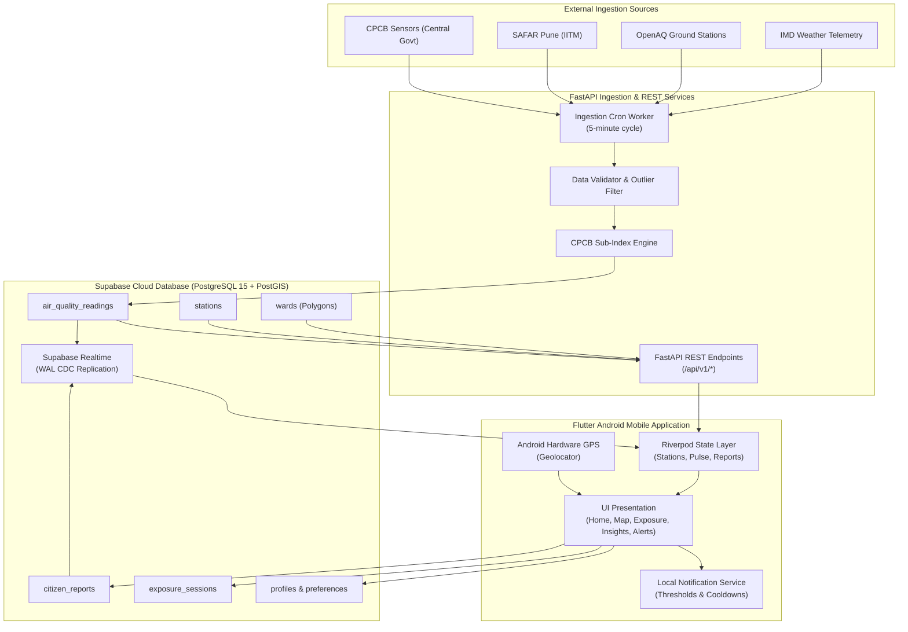
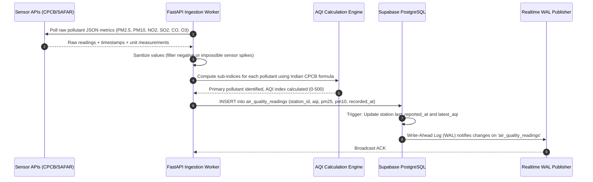
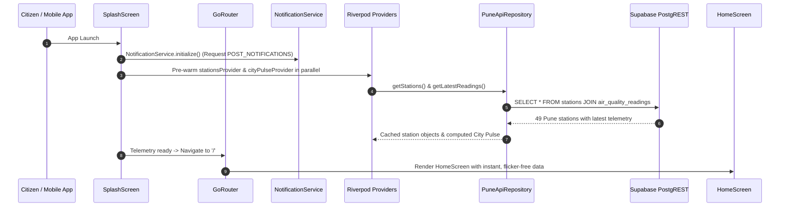
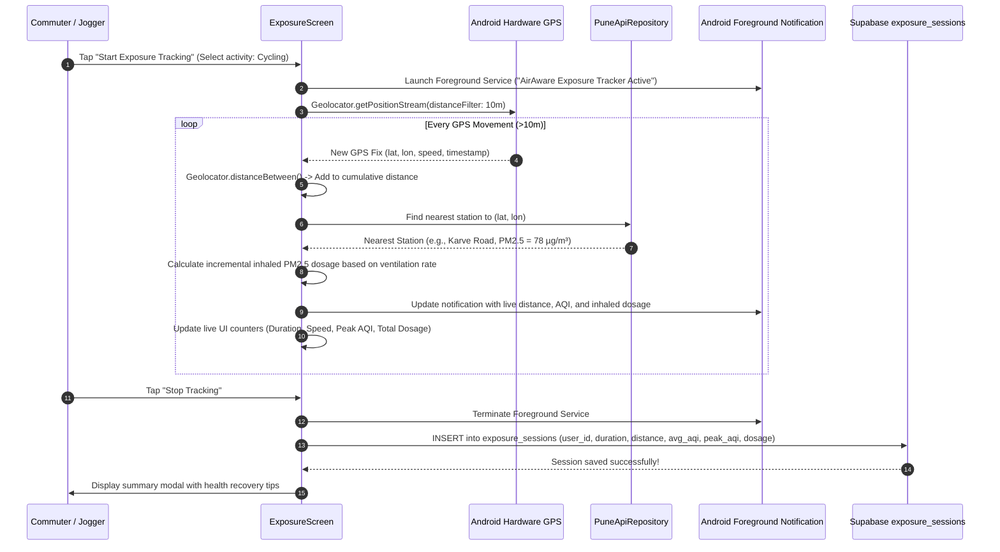
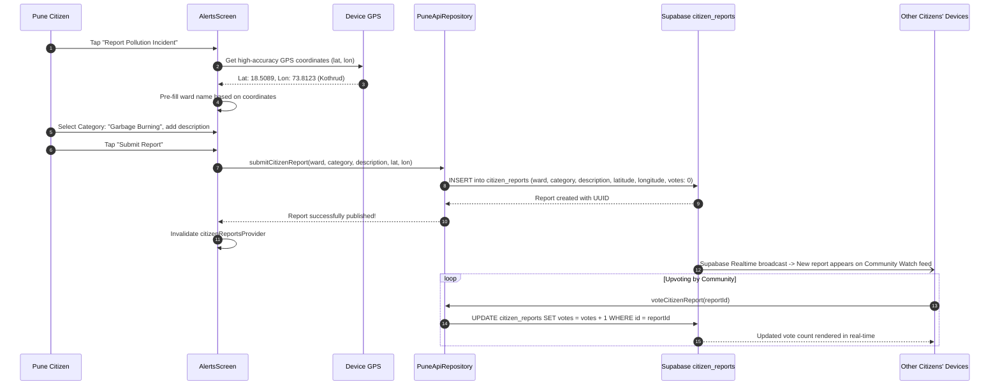
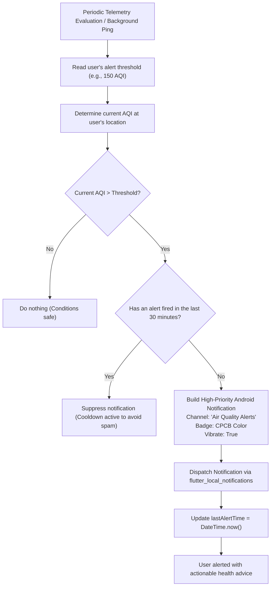

# AirAware Pune: End-to-End System & Data Flow Architecture

This document provides a comprehensive, lifecycle-based explanation of how data originates, travels, transforms, and is presented across the **AirAware** mobile platform. It traces every user interaction, background sensor telemetry pipeline, spatial query, and database transaction.

---

## 1. High-Level System Architecture Diagram

---

## 2. Ingestion to Database Pipeline (The 5-Minute Ingestion Loop)

Every 5 minutes, the automated ingestion engine runs to refresh air quality readings across Pune's 49 monitoring stations:

### Ingestion Details:
1. **Source Multiplexing**: If a primary CPCB station is offline, the ingestion engine falls back to secondary OpenAQ or SAFAR monitors within the same ward.
2. **Indian National AQI (CPCB) Standard**:
   - Sub-index calculated for all valid pollutants.
   - Overall AQI equals the maximum sub-index:
     $$\text{AQI} = \max(I_{PM_{2.5}}, I_{PM_{10}}, I_{NO_2}, I_{SO_2}, I_{CO}, I_{O_3})$$
   - A minimum of 3 pollutants (with at least one being $PM_{2.5}$ or $PM_{10}$) must be active to publish an authoritative AQI.

---

## 3. Mobile Startup & Telemetry Pre-Warming Flow

When a Pune citizen launches the AirAware Android app:

---

## 4. Real-Time Outdoor Exposure & Dosage Tracking Flow

This is one of the most critical features of AirAware, enabling joggers, cyclists, and commuters to record real inhaled pollution:

### Inhaled Dosage Formula:
AirAware implements the clinical inhalation model:
$$\text{Dosage } (\mu g) = \sum_{i=1}^{n} \left[ C_i \times V_E \times \Delta t_i \right]$$
Where:
- $C_i$: Ambient concentration of $PM_{2.5}$ ($\mu g/m^3$) at interval $i$ from nearest station.
- $V_E$: Minute ventilation rate ($m^3/\text{minute}$):
  - **Sedentary/Rest**: $0.008 \, m^3/\text{min}$
  - **Walking**: $0.015 \, m^3/\text{min}$
  - **Running/Cycling**: $0.035 \, m^3/\text{min}$
- $\Delta t_i$: Elapsed interval in minutes.

---

## 5. Community Watch & Citizen Incident Reporting Flow

When a citizen detects localized pollution (e.g., open trash burning, dust emission):

---

## 6. Personal AQI Alert & Cooldown Deduplication Engine

To avoid overwhelming users with repeated alerts while keeping them protected from sudden pollution spikes:

---

## 7. Interactive Map & Spatial Queries Flow

When a citizen browses the interactive Pune map:

1. **Vector Tiles**: Map tiles are rendered dynamically using OpenStreetMap/CartoDB tiles via `flutter_map`.
2. **Ward Overlay**: `assets/pune_wards.geojson` is loaded into memory, rendering the geographic boundaries of all 49 Pune Municipal Corporation administrative wards with semi-transparent fills reflecting the ward's aggregate AQI.
3. **Station Pins**: 49 station pins are placed precisely at their EPSG:4326 coordinates ($(\text{lon}, \text{lat})$). Pins are styled with live CPCB color gradients.
4. **User Recenter**: Tapping the "Locate Me" button queries `Geolocator.getCurrentPosition()`, smoothly animating the camera to the user's location without colliding with the bottom navigation bar.

---

## 8. Summary of Data Resilience & Integrity Guarantees

- **No Stale UI**: All Riverpod providers feature smart caching with periodic refresh invalidation.
- **Fail-Safe Offline Mode**: If network connectivity drops, the app gracefully presents the last known telemetry from local cache with a clear "Offline - Showing cached data" badge.
- **Zero Mock Compromise**: Every screen in the app connects to genuine database tables and device hardware APIs.
