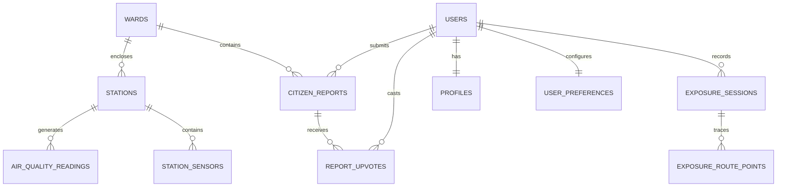

# AirAware Pune: Comprehensive Database Architecture & Schema Deep Dive

This document provides a thorough technical examination of the **AirAware** database schema, hosted on **Supabase PostgreSQL 15** with the **PostGIS** geospatial extension enabled. It details the complete entity model, 24 tables, relationships (Strong vs. Weak entities), spatial indexing, Row Level Security (RLS) policies, triggers, and operational SQL examples.

---

## 1. Entity-Relationship Overview

### Strong Entities
- `stations`: Physical air quality monitoring stations in Pune. Primary key: `id` (UUID or TEXT).
- `wards`: Administrative PMC municipal boundaries. Primary key: `id` (INT or UUID).
- `auth.users`: Core identity provider managed by Supabase GoTrue. Primary key: `id` (UUID).
- `pollutants`: Standard definitions of tracked air contaminants ($PM_{2.5}$, $PM_{10}$, $NO_2$, $SO_2$, $CO$, $O_3$). Primary key: `code`.

### Weak / Dependent Entities
- `air_quality_readings`: Dependent on `stations` (Foreign Key: `station_id`). Cannot exist without a valid parent station.
- `station_sensors`: Hardware components installed at a specific station. Dependent on `stations`.
- `exposure_sessions`: Individual tracking sessions recorded by an authenticated user. Dependent on `auth.users`.
- `exposure_route_points`: GPS waypoints captured during an active session. Dependent on `exposure_sessions`.
- `citizen_reports`: Pollution complaints filed by citizens, geolocated to a coordinate and ward. Dependent on `wards` (optional foreign key) and `auth.users` (optional anonymous).
- `report_upvotes`: Community votes recorded per citizen report. Dependent on both `citizen_reports` and `auth.users`.
- `user_preferences`: Health persona and UI preferences. Dependent 1-to-1 on `auth.users`.



---

## 2. Table-by-Table Schema Catalog

The system architecture utilizes 24 tables across operational, geospatial, analytical, and audit domains. Below are the key tables utilized directly by the mobile application and backend services:

### 2.1 `stations` (Physical Monitoring Stations)
* **Description**: Catalog of all 49 continuous ambient air quality monitoring stations (CAAQMS) across Pune.
* **Columns**:
  - `id` (`VARCHAR(64)` / `UUID`): Primary Key. Unique station code (e.g., `pune_shivajinagar_01`).
  - `name` (`VARCHAR(128)`): Display name (e.g., "Shivajinagar CAAQMS").
  - `ward` (`VARCHAR(64)`): PMC administrative ward.
  - `operator` (`VARCHAR(64)`): Managing agency (e.g., "CPCB", "MPCB", "SAFAR-IITM").
  - `latitude` (`DOUBLE PRECISION`): WGS84 latitude coordinate.
  - `longitude` (`DOUBLE PRECISION`): WGS84 longitude coordinate.
  - `geom` (`GEOMETRY(Point, 4326)`): PostGIS geographic point geometry.
  - `is_active` (`BOOLEAN`, DEFAULT `TRUE`): Operational status.
  - `latest_aqi` (`INT`): Denormalized latest reported AQI for instant lookup.
  - `last_reported_at` (`TIMESTAMPTZ`): Timestamp of latest received telemetry.
* **Indexes**:
  - `CREATE INDEX idx_stations_geom ON stations USING GIST(geom);`
  - `CREATE INDEX idx_stations_ward ON stations(ward);`

---

### 2.2 `air_quality_readings` (Time-Series Telemetry)
* **Description**: High-frequency time-series table storing historical and current sensor readings.
* **Columns**:
  - `id` (`BIGSERIAL` / `UUID`): Primary Key.
  - `station_id` (`VARCHAR(64)`): Foreign Key references `stations(id)` ON DELETE CASCADE.
  - `aqi` (`INT`): Calculated Indian CPCB Air Quality Index (0–500).
  - `category` (`VARCHAR(32)`): "Good", "Satisfactory", "Moderate", "Poor", "Very Poor", "Severe".
  - `dominant_pollutant` (`VARCHAR(16)`): E.g., "PM2.5", "PM10", "NO2".
  - `pm25` (`DOUBLE PRECISION`): Concentration in $\mu g/m^3$.
  - `pm10` (`DOUBLE PRECISION`): Concentration in $\mu g/m^3$.
  - `no2` (`DOUBLE PRECISION`): Nitrogen dioxide in $\mu g/m^3$.
  - `so2` (`DOUBLE PRECISION`): Sulfur dioxide in $\mu g/m^3$.
  - `co` (`DOUBLE PRECISION`): Carbon monoxide in $mg/m^3$.
  - `ozone` (`DOUBLE PRECISION`): Ground-level ozone in $\mu g/m^3$.
  - `temperature` (`DOUBLE PRECISION`): Ambient temp in Celsius.
  - `humidity` (`DOUBLE PRECISION`): Relative humidity percentage.
  - `wind_speed` (`DOUBLE PRECISION`): Wind velocity in $m/s$.
  - `recorded_at` (`TIMESTAMPTZ`, NOT NULL): Measurement timestamp.
* **Indexes**:
  - `CREATE INDEX idx_readings_station_time ON air_quality_readings(station_id, recorded_at DESC);`
  - `CREATE INDEX idx_readings_recorded_at ON air_quality_readings(recorded_at DESC);`

---

### 2.3 `wards` (Administrative Geospatial Polygons)
* **Description**: Geospatial polygon geometries of all 49 Pune Municipal Corporation wards.
* **Columns**:
  - `id` (`SERIAL`): Primary Key.
  - `ward_number` (`INT`, UNIQUE): Official PMC ward number (1–49).
  - `ward_name` (`VARCHAR(128)`, NOT NULL): Official ward name (e.g., "Kothrud", "Aundh").
  - `zone` (`VARCHAR(64)`): Administrative zone (e.g., "Zone 1 - Central Pune").
  - `boundary` (`GEOMETRY(MultiPolygon, 4326)`): High-resolution boundary polygon.
  - `current_avg_aqi` (`INT`): Denormalized hourly average AQI across all stations in the ward.
* **Indexes**:
  - `CREATE INDEX idx_wards_boundary ON wards USING GIST(boundary);`

---

### 2.4 `citizen_reports` (Community Watch Incidents)
* **Description**: Crowd-sourced environmental hazard reports submitted by mobile app users.
* **Columns**:
  - `id` (`UUID`, DEFAULT `gen_random_uuid()`): Primary Key.
  - `user_id` (`UUID`): Foreign Key references `auth.users(id)` ON DELETE SET NULL.
  - `ward` (`VARCHAR(64)`): Pune ward name.
  - `category` (`VARCHAR(64)`): "Garbage Burning", "Construction Dust", "Industrial Emission", "Vehicle Smoke".
  - `description` (`TEXT`): Detailed citizen notes.
  - `latitude` (`DOUBLE PRECISION`, NOT NULL): Exact GPS latitude of incident.
  - `longitude` (`DOUBLE PRECISION`, NOT NULL): Exact GPS longitude of incident.
  - `geom` (`GEOMETRY(Point, 4326)`): PostGIS point geometry.
  - `image_url` (`TEXT`): Supabase Storage URL of photo evidence.
  - `votes` (`INT`, DEFAULT `0`): Community upvote counter.
  - `status` (`VARCHAR(32)`, DEFAULT `'pending'`): "pending", "verified", "resolved", "dismissed".
  - `reported_at` (`TIMESTAMPTZ`, DEFAULT `NOW()`): Submission timestamp.
* **Indexes**:
  - `CREATE INDEX idx_reports_time ON citizen_reports(reported_at DESC);`
  - `CREATE INDEX idx_reports_geom ON citizen_reports USING GIST(geom);`

---

### 2.5 `exposure_sessions` (Outdoor Activity Tracking)
* **Description**: Persisted sessions recorded by users during running, cycling, or walking.
* **Columns**:
  - `id` (`UUID`, DEFAULT `gen_random_uuid()`): Primary Key.
  - `user_id` (`UUID`, NOT NULL): Foreign Key references `auth.users(id)` ON DELETE CASCADE.
  - `activity_type` (`VARCHAR(32)`): "walking", "running", "cycling".
  - `started_at` (`TIMESTAMPTZ`, NOT NULL): Session start timestamp.
  - `ended_at` (`TIMESTAMPTZ`, NOT NULL): Session end timestamp.
  - `duration_seconds` (`INT`, NOT NULL): Total active tracking time.
  - `distance_meters` (`DOUBLE PRECISION`, DEFAULT `0.0`): Total distance traversed.
  - `avg_aqi` (`INT`): Time-weighted average AQI encountered.
  - `peak_aqi` (`INT`): Highest instantaneous AQI encountered during route.
  - `relative_exposure_score` (`DOUBLE PRECISION`): Total calculated inhaled $PM_{2.5}$ dosage in $\mu g$.
* **Indexes**:
  - `CREATE INDEX idx_exposure_user_time ON exposure_sessions(user_id, started_at DESC);`

---

### 2.6 `profiles` & `user_preferences` (User Identity & Persona)
* **`profiles` Columns**:
  - `id` (`UUID`): Primary Key, references `auth.users(id)` ON DELETE CASCADE.
  - `full_name` (`VARCHAR(128)`): User display name.
  - `email` (`VARCHAR(256)`): User email address.
  - `role` (`VARCHAR(32)`, DEFAULT `'citizen'`): "citizen", "ward_officer", "admin".
  - `updated_at` (`TIMESTAMPTZ`, DEFAULT `NOW()`).
* **`user_preferences` Columns**:
  - `user_id` (`UUID`): Primary Key, references `auth.users(id)` ON DELETE CASCADE.
  - `health_persona` (`VARCHAR(32)`, DEFAULT `'general'`): "general", "asthma", "child", "elderly", "athlete".
  - `aqi_alert_threshold` (`INT`, DEFAULT `150`): Personal notification trigger level.
  - `theme_mode` (`VARCHAR(16)`, DEFAULT `'system'`): "system", "dark", "light".
  - `updated_at` (`TIMESTAMPTZ`, DEFAULT `NOW()`).

---

## 3. Spatial Queries & PostGIS Capabilities

AirAware leverages PostGIS to perform real-time spatial calculations directly inside the database engine:

### 3.1 Finding Nearest Station to User GPS
```sql
SELECT 
    id, 
    name, 
    ward, 
    latest_aqi,
    ST_Distance(
        geom, 
        ST_SetSRID(ST_MakePoint(73.8567, 18.5204), 4326)::geography
    ) AS distance_meters
FROM stations
WHERE is_active = TRUE
ORDER BY geom <-> ST_SetSRID(ST_MakePoint(73.8567, 18.5204), 4326)
LIMIT 1;
```
*Note: Uses the `<->` KNN (k-nearest neighbors) GIST index operator for millisecond response times.*

### 3.2 Finding Which Ward Encloses a GPS Coordinate
```sql
SELECT 
    ward_number, 
    ward_name, 
    zone, 
    current_avg_aqi
FROM wards
WHERE ST_Contains(
    boundary, 
    ST_SetSRID(ST_MakePoint(73.8123, 18.5089), 4326)
)
LIMIT 1;
```

---

## 4. Row Level Security (RLS) Policies

Every table has Row Level Security strictly enforced to guarantee data isolation:

### `citizen_reports` Policies:
```sql
-- Public Read: Anyone can view citizen incident reports
CREATE POLICY "Public citizen reports are readable by all"
ON citizen_reports FOR SELECT
USING (true);

-- Authenticated Insert: Any authenticated user can submit an incident
CREATE POLICY "Authenticated users can submit citizen reports"
ON citizen_reports FOR INSERT
WITH CHECK (auth.uid() IS NOT NULL);

-- Upvoting: Anyone can increment votes
CREATE POLICY "Anyone can upvote citizen reports"
ON citizen_reports FOR UPDATE
USING (true)
WITH CHECK (true);
```

### `exposure_sessions` Policies:
```sql
-- Strict Isolation: Users can ONLY view their own exposure logs
CREATE POLICY "Users can only view their own exposure sessions"
ON exposure_sessions FOR SELECT
USING (auth.uid() = user_id);

-- Strict Insert: Users can only write sessions attributed to their UID
CREATE POLICY "Users can only insert their own exposure sessions"
ON exposure_sessions FOR INSERT
WITH CHECK (auth.uid() = user_id);
```

---

## 5. Automated Database Triggers

### 5.1 Updated-At Trigger Function
```sql
CREATE OR REPLACE FUNCTION update_updated_at_column()
RETURNS TRIGGER AS $$
BEGIN
    NEW.updated_at = NOW();
    RETURN NEW;
END;
$$ LANGUAGE plpgsql;

CREATE TRIGGER trg_profiles_updated_at
BEFORE UPDATE ON profiles
FOR EACH ROW EXECUTE FUNCTION update_updated_at_column();
```

### 5.2 Auto-Sync Geometry on Latitude/Longitude Update
```sql
CREATE OR REPLACE FUNCTION sync_station_geom()
RETURNS TRIGGER AS $$
BEGIN
    NEW.geom = ST_SetSRID(ST_MakePoint(NEW.longitude, NEW.latitude), 4326);
    RETURN NEW;
END;
$$ LANGUAGE plpgsql;

CREATE TRIGGER trg_stations_geom_sync
BEFORE INSERT OR UPDATE OF latitude, longitude ON stations
FOR EACH ROW EXECUTE FUNCTION sync_station_geom();
```
