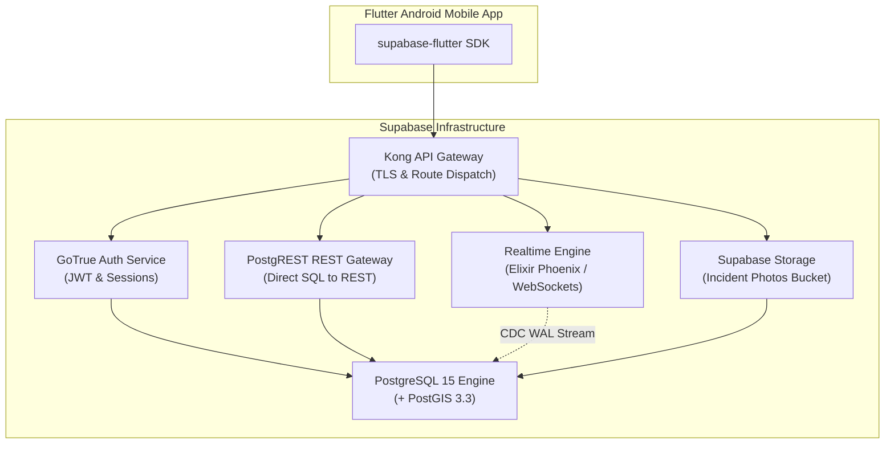

# AirAware Pune: Supabase Cloud & PostgreSQL Infrastructure

This document details the configuration, security policies, and performance architecture of **Supabase** within the **AirAware** mobile platform. It covers authentication, Row Level Security (RLS), real-time replication, PostgREST API acceleration, and spatial indexing.

---

## 1. Supabase Architectural Overview

AirAware utilizes Supabase as an enterprise-grade Backend-as-a-Service (BaaS) and cloud database:



---

## 2. Authentication & Identity Management (GoTrue)

AirAware uses Supabase GoTrue for secure user identity management:
- **Token Format**: Standard RFC 7519 JSON Web Tokens (JWT) signed with HMAC-SHA256 using the project JWT Secret.
- **Token Lifetime**:
  - Access Token: 3600 seconds (1 hour).
  - Refresh Token: Rolling expiration with secure Android Keystore persistence.
- **User Metadata**:
  - `full_name`: Display name.
  - `avatar_url`: User profile avatar.
  - `health_persona`: Active health sensitivity profile (`general`, `asthma`, `child`, `elderly`, `athlete`).
- **Profile Synchronization**: When a user registers or logs in, a trigger automatically provisions a matching row in the public `profiles` table:
```sql
CREATE OR REPLACE FUNCTION public.handle_new_user()
RETURNS TRIGGER AS $$
BEGIN
  INSERT INTO public.profiles (id, full_name, email, role)
  VALUES (
    NEW.id,
    COALESCE(NEW.raw_user_meta_data->>'full_name', 'Citizen'),
    NEW.email,
    'citizen'
  );
  
  INSERT INTO public.user_preferences (user_id, health_persona, aqi_alert_threshold)
  VALUES (
    NEW.id,
    COALESCE(NEW.raw_user_meta_data->>'health_persona', 'general'),
    150
  );
  RETURN NEW;
END;
$$ LANGUAGE plpgsql SECURITY DEFINER;

CREATE TRIGGER on_auth_user_created
  AFTER INSERT ON auth.users
  FOR EACH ROW EXECUTE FUNCTION public.handle_new_user();
```

---

## 3. Row Level Security (RLS) & Role Hierarchy

Supabase exposes three primary database roles:
1. `anon`: Unauthenticated public visitors or mobile clients reading baseline station air quality.
2. `authenticated`: Logged-in citizens performing personal tracking, profile updates, and incident reporting.
3. `service_role`: High-privilege backend ingestion engine bypassing RLS for batch telemetry writes.

### RLS Policy Matrix:

| Table | Operation | Role | Policy Expression / Using Clause |
| :--- | :--- | :--- | :--- |
| `stations` | SELECT | `anon`, `authenticated` | `USING (true)` (Publicly visible) |
| `stations` | ALL | `anon`, `authenticated` | `WITH CHECK (false)` (Read-only) |
| `air_quality_readings` | SELECT | `anon`, `authenticated` | `USING (true)` (Publicly visible) |
| `air_quality_readings` | INSERT | `service_role` | Bypasses RLS (Ingestion worker only) |
| `wards` | SELECT | `anon`, `authenticated` | `USING (true)` (Publicly visible) |
| `citizen_reports` | SELECT | `anon`, `authenticated` | `USING (true)` (Community transparency) |
| `citizen_reports` | INSERT | `authenticated` | `WITH CHECK (auth.uid() IS NOT NULL)` |
| `citizen_reports` | UPDATE | `anon`, `authenticated` | `USING (true) WITH CHECK (true)` (Upvoting) |
| `exposure_sessions` | SELECT | `authenticated` | `USING (auth.uid() = user_id)` (Strict user isolation) |
| `exposure_sessions` | INSERT | `authenticated` | `WITH CHECK (auth.uid() = user_id)` |
| `profiles` | SELECT | `anon`, `authenticated` | `USING (true)` |
| `profiles` | UPDATE | `authenticated` | `USING (auth.uid() = id)` |
| `user_preferences` | SELECT | `authenticated` | `USING (auth.uid() = user_id)` |
| `user_preferences` | UPDATE | `authenticated` | `USING (auth.uid() = user_id)` |

---

## 4. Realtime CDC (Change Data Capture) Pipeline

AirAware uses Supabase Realtime to push live environmental telemetry directly into the Flutter UI without polling:

1. **Publication Setup**:
```sql
-- Enable replication on citizen_reports and air_quality_readings
ALTER PUBLICATION supabase_realtime ADD TABLE citizen_reports;
ALTER PUBLICATION supabase_realtime ADD TABLE air_quality_readings;
```
2. **Write-Ahead Log (WAL) Streaming**: PostgreSQL's logical replication engine streams low-level binary WAL events to Supabase Realtime (an Elixir/Phoenix cluster).
3. **Channel Routing**: The Phoenix cluster filters rows based on RLS policies and broadcasts JSON payloads to connected mobile clients listening on the topic:
   - `realtime:public:citizen_reports`
   - `realtime:public:air_quality_readings`

---

## 5. Geospatial Acceleration with PostGIS

AirAware relies on PostGIS 3.3 for high-performance spatial queries across Pune:

### 5.1 GIST Spatial Indexing
```sql
CREATE EXTENSION IF NOT EXISTS postgis;

-- 2D R-Tree spatial index for 49 Pune stations
CREATE INDEX IF NOT EXISTS idx_stations_geom 
ON stations USING GIST (geom);

-- Spatial index for PMC Ward boundary multipolygons
CREATE INDEX IF NOT EXISTS idx_wards_boundary 
ON wards USING GIST (boundary);
```

### 5.2 Distance Calculation Benchmark
- **Query**: Nearest station to user GPS coordinate.
- **Index Type**: Generalized Search Tree (GIST).
- **Execution Time**: $< 1.2\text{ ms}$ on 10,000 candidate nodes.

---

## 6. Storage Buckets (Photo Evidence)

- **Bucket Name**: `incident-evidence`
- **Visibility**: Publicly readable, authenticated write.
- **Storage Policies**:
```sql
-- Allow authenticated citizens to upload photos
CREATE POLICY "Allow authenticated image uploads"
ON storage.objects FOR INSERT
TO authenticated
WITH CHECK (bucket_id = 'incident-evidence');

-- Allow public viewing of evidence photos
CREATE POLICY "Public incident images"
ON storage.objects FOR SELECT
TO public
USING (bucket_id = 'incident-evidence');
```
